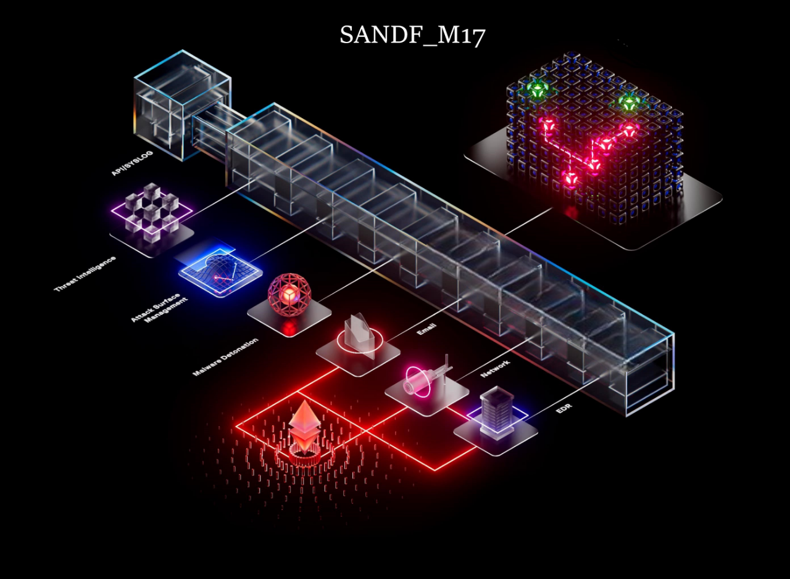
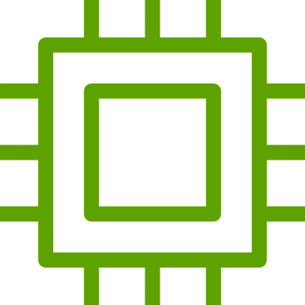
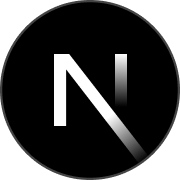

<div >
<p align="center" style="padding: 50px; position: relative; width: 80%; margin: auto;">
        
       <h2 align="center" > SECURE ANALYSIS OF NEXT-GEN DEFI </h2>
    </p>
 
  <br>
  
  ### About Me...                                   
    
  - 🔗 I’m currently learning Blockchain - security researcher.
  - 👐 I’m looking to contribute to open source
   - 🥅 2025 Goals: Learn more about Blockchains and security .
  - ⚡ Fun fact: I love to play games and R & W docs.

      

<div style="text-align: left , color:red ">
</div>
    
   
   ### <a href="https://www.animatedimages.org/cat-computer-56.htm"></a> A little more about me...
   
 </div>
    
   
``` solidity
    // SPDX-License-Identifier: MIT
    pragma solidity ^0.8.24;
    
    contract Profile {
        string public name = "SNADF_M17";
        string public pronouns = "He | Him";
        string public currentFocus = "Web3 / dApps";
    
        string[] internal skills;

    function getSkills() public view returns (string[] memory) {
        string;
        skills[0] = "JavaScript";
        skills[1] = "Next.js";
        skills[2] = "React";
        skills[3] = "Solidity";
        skills[5] = "ethers.js";
        return skills;
    }
    
    function fun() public view returns (string memory) {
        uint256 randomNumber = uint256(keccak256(abi.encodePacked(blockhash(block.number - 1), msg.sender)));

         if (randomNumber % 2 == 0) {
             return "Why did the Ethereum developer bring a ladder? To reach the next layer-2!";
        } else {
             return "Why don’t blockchains ever gossip? They only share verified information!";
       }
     }

    }
 ```
    
   <br>

<div style="background-color: black; padding: 10px; display: inline-block; border-radius: 8px;">
    <a href='https://archiveprogram.github.com/'></a> 
    <a href='https://docs.github.com/en/developers'></a> 
    <a href='https://github.com/pricing'></a> 
    <a href='https://stars.github.com/'></a> 
    <a href='https://docs.github.com/en/github/supporting-the-open-source-community-with-github-sponsors'></a>
</div>

    
  ---

   <div align="center">
    
  ##  My Skill Set
    
   <br>
    

<a href="https://reactjs.org/" target="_blank"></a>
<a href="https://www.javascript.com/" target="_blank"></a><a href="https://www.typescriptlang.org/" target="_blank"></a><a href="./" target="_blank"></a> <a href="https://nodejs.org/" target="_blank"><a href="https://www.mongodb.com/" target="_blank"></a>

  </div>

<br></img>
 </div>
